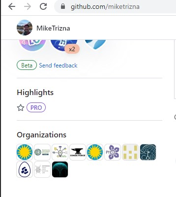
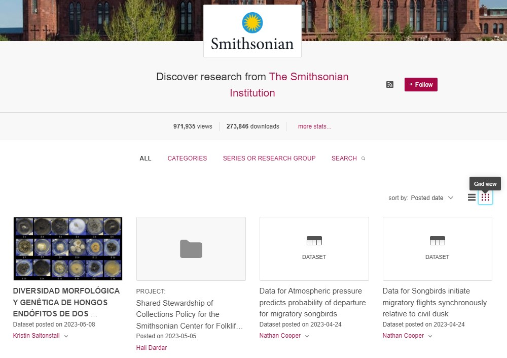

# Smithsonian Specifics

## Organizations on GitHub

So far we have gone through all of the exercises in this workshop using our personal GitHub accounts. But GitHub has organizations, which allow for more capabilities.

### Benefits of Organizations: Branding

Putting a repository in an organization can give you a more fitting link to share. For example, all of the Smithsonian Carpentries workshop websites are on either the "Smithsonian" or "SmithsonianWorkshops" (which actually came first) organizations. So the URL for today's workshop is https://smithsonianworkshops.github.io/2023-05-09-smithsonian/.

Also, if you join the Smithsonian organization (info on how to do that is below), you can get a little indicator that shows you are affiliated with the Smithsonian. This is helpful when using your GitHub profile as a portfolio.

### Benefits of Organizations: Teams

In the ["GitHub Issues and Pull Requests"](contributing.md) section, we showed how to connect with other GitHub users on a user-by-user level. However, GitHub organizations offer the concept of Teams, which let you put together groups of users that have pre-defined permissons. For example, you can create a new lesson repository (like this one) in the Smithsonian organization, and give direct edit permissions to the entire Carpentries team.

### How to join the Smithsonian organization

Here is a [Smithsonian KnowledgeBase article about GitHub](https://smithsonianprod.servicenowservices.com/si?sys_kb_id=e25737db1b93dc109b33dc6ce54bcbf5&id=kb_article_view&sysparm_rank=1&sysparm_tsqueryId=746fb4f21ba6991010c12020f54bcb64).

The best way to request to join the Smithsonian organization is to put in a ServiceNow request.

## Smithsonian Figshare for data

GitHub is great for running version control on text-based documents like code files and markdown documents, but it gets very compute-intensive to try to track differences between large files -- especially if they are not text-based. In fact, GitHub imposes a 100 MB per-file limit, and a 1GB limit per repository.

To solve this large file issue, the Smithsonian also has a paid agreement with the Figshare organization for storing large datasets.

Benefits of using FigShare for storing your data are:

* Digital Object Identifiers (DOIs) for referencing and citing data files
* Version-control as well, in the sense that you can post new versions of files. No GitHub-like differences are shown though.

Anyone with Smithsonian credentials should be able to log on and create their own Figshare for Institutions account at https://smithsonian.figshare.com.

Here is a [Smithsonian KnowledgeBase article about Figshare](https://smithsonianprod.servicenowservices.com/si?sys_kb_id=df2bfbe21bb2581410c12020f54bcb30&id=kb_article_view&sysparm_rank=1&sysparm_tsqueryId=f09bb6e21bae191010c12020f54bcbad)
